# AI Coding Learner 系统架构文档

> 版本 1.2.1 | 技术栈：Electron 28 + Vue 3 + TypeScript + SQLite

> **v1.2.1 更新摘要**：修复 v1.2.0 升级时数据库种子数据不刷新的严重 bug — 新增 `app_meta` 数据版本表，seedData 改为版本号驱动，升级时自动清除旧课程/章节/任务数据并重新填充，保留用户配置和学习时长
>
> **v1.2.0 更新摘要**：①15 章节补充真实 B 站视频 + 每章 4 个配套学习资源；②实操任务分步引导增强（新增 referenceCode/expectedResult）；③修复右侧面板按钮截断布局问题（sticky 底部操作栏）
>
> **v1.1.0 更新摘要**：实操实验室全面升级 — Monaco 编辑器替换 textarea、Web Worker 沙箱执行代码、5+1 分步引导任务、OpenAI 兼容 LLM 接入

---

## 一、项目概述

AI Coding Learner 是一款基于 Electron 的桌面学习应用，采用前后端分离的双进程架构。前端使用 Vue 3 Composition API 构建 SPA 界面，后端通过 Electron 主进程管理 SQLite 数据库和系统级操作。

### 技术栈

| 层级 | 技术 | 版本 | v1.2 变更 |
|------|------|------|-----------|
| 桌面框架 | Electron | 28.x | — |
| 前端框架 | Vue 3 | 3.4.x | — |
| 类型系统 | TypeScript | 5.3.x | — |
| 构建工具 | Vite | 5.1.x | — |
| 状态管理 | Pinia | 2.1.x | — |
| 路由 | Vue Router | 4.3.x | — |
| 数据库 | better-sqlite3 | 11.x | — |
| 代码编辑器 | @guolao/vue-monaco-editor | 1.x | — |
| 代码执行沙箱 | Web Worker | 原生 | — |
| LLM 接入 | OpenAI 兼容 fetch | — | — |
| Markdown 渲染 | markdown-it + highlight.js | 14.x / 11.x | — |
| 打包工具 | electron-builder | 24.x | — |
| Electron 插件 | vite-plugin-electron | 0.28.x | — |

---

## 二、系统架构总览

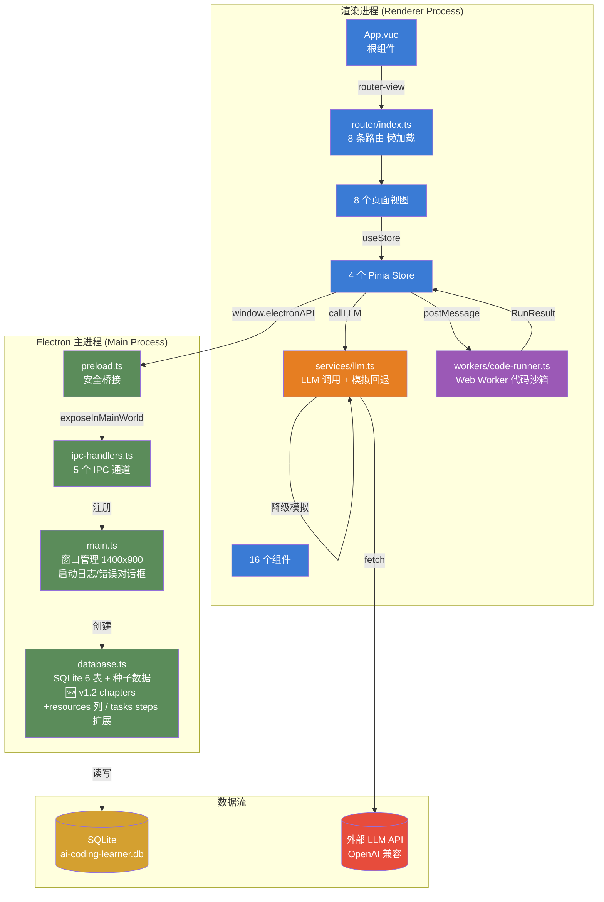

---

## 三、目录结构

```
ai-coding-learner/
├── electron/                    # Electron 主进程代码
│   ├── main.ts                  # 应用入口，窗口创建 (1400x900)  v1.1 启动日志/错误对话框
│   ├── preload.ts               # 安全桥接层 (contextBridge)
│   ├── database.ts              # SQLite 数据库初始化 + 种子数据  🆕 v1.2 chapters +resources 列 / 15 章真实 B 站视频 / 6 任务步骤扩展 referenceCode+expectedResult
│   └── ipc-handlers.ts          # IPC 通信处理器 (5 个通道)
│
├── src/                         # 渲染进程（Vue 前端）
│   ├── App.vue                  # 根组件
│   ├── main.ts                  # Vue 应用入口
│   ├── env.d.ts                 # TypeScript 类型声明
│   ├── types/
│   │   └── index.ts             # TS 接口/类型定义  v1.1 新增 TaskStep/TestCase/RunResult；🆕 v1.2 新增 ChapterResource，TaskStep 扩展 referenceCode/expectedResult
│   ├── router/
│   │   └── index.ts             # 8 条路由（全部懒加载）
│   ├── stores/                  # Pinia 状态管理
│   │   ├── user.ts              # 用户配置  v1.1 LLM 配置字段
│   │   ├── courses.ts           # 课程 + 章节  v1.1 setCurrentCategory；🆕 v1.2 loadChapters 解析 resources JSON
│   │   ├── practice.ts          # 实操任务 + 计时  v1.1 Web Worker 执行 + 分步引导
│   │   └── progress.ts          # 学习统计
│   ├── services/                # v1.1 新增 服务层
│   │   └── llm.ts               # LLM API 调用 + 模拟回退
│   ├── workers/                 # v1.1 新增 Web Worker
│   │   └── code-runner.ts       # 代码执行沙箱（类型剥离 + 测试验证）
│   ├── views/                   # 页面视图 (8 个)
│   │   ├── HomeView.vue         # 首页仪表盘
│   │   ├── LearnView.vue        # 课程列表
│   │   ├── CourseDetailView.vue # 课程详情
│   │   ├── ChapterView.vue      # 章节学习（核心页面）  🆕 v1.2 新增配套学习资源列表
│   │   ├── PracticeView.vue     # 任务列表  v1.1 显示步数/测试数/引导项目标签
│   │   ├── TaskView.vue         # 任务编辑器  v1.1 Monaco + 分步引导 + 测试结果 + AI 助手；🆕 v1.2 右侧改为滚动内容 + 固定底部操作栏
│   │   ├── ProgressView.vue     # 学习统计
│   │   └── SettingsView.vue     # 用户设置  v1.1 LLM API Key 配置
│   ├── components/              # 公共组件 (16 个)
│   │   ├── common/              # 通用组件 (4 个)
│   │   │   ├── ProgressBar.vue
│   │   │   ├── StatCard.vue
│   │   │   ├── EmptyState.vue
│   │   │   └── LoadingSpinner.vue
│   │   ├── layout/              # 布局组件 (3 个)
│   │   │   ├── AppLayout.vue
│   │   │   ├── AppSidebar.vue
│   │   │   └── AppHeader.vue
│   │   ├── learn/               # 学习组件 (3 个)
│   │   │   ├── CourseCard.vue
│   │   │   ├── ChapterTree.vue
│   │   │   └── ContentViewer.vue
│   │   ├── practice/            # 实操组件 (3 个)  v1.1 全部重写
│   │   │   ├── CodeEditor.vue   # Monaco Editor (vs-dark 主题)
│   │   │   ├── TaskPanel.vue    # 分步引导 + 提示；🆕 v1.2 预期效果卡片 + 参考代码切换
│   │   │   └── AiChatSimulator.vue # 真实 LLM / 模拟模式
│   │   └── progress/            # 统计组件 (3 个)
│   │       ├── DurationChart.vue
│   │       ├── CalendarHeatmap.vue
│   │       └── WeeklyReport.vue
│   └── assets/
│       └── styles/
│           ├── variables.css    # 50+ CSS 设计令牌（竹绿色主题）
│           └── global.css       # 全局样式 + 工具类
│
├── 使用文档.md                  # 用户使用文档
├── 系统架构文档.md              # 系统架构设计文档
├── README.md                    # 项目说明
├── package.json                 # 项目配置 + 依赖
├── vite.config.ts               # Vite + Electron 插件配置
├── tsconfig.json                # TypeScript 配置
├── tsconfig.node.json           # Node 端 TypeScript 配置
└── electron-builder.yml         # 打包配置
```

---

## 四、双进程架构

### 4.1 主进程 (Main Process)

**文件**: `electron/main.ts`

负责：
- 创建 BrowserWindow（1400x900，最小 1024x680）
- 初始化 SQLite 数据库
- 注册 IPC 通信处理器
- 管理应用生命周期
- v1.1 新增：启动日志写入 `startup.log`，数据库初始化失败时弹出错误对话框

```typescript
// 窗口配置
new BrowserWindow({
  width: 1400, height: 900,
  minWidth: 1024, minHeight: 680,
  webPreferences: {
    preload: path.join(__dirname, 'preload.js'),
    contextIsolation: true,    // 安全隔离
    nodeIntegration: false     // 禁用 Node 集成
  }
})
```

v1.1 启动日志机制：
```typescript
// 记录启动信息到 userData/startup.log
fs.appendFileSync(logPath,
  `[${new Date().toISOString()}] App started, userData=${app.getPath('userData')}\n`)

// 数据库初始化失败时弹出错误对话框
try { initDatabase() }
catch (err) {
  mainWindow.webContents.on('did-finish-load', () => {
    dialog.showErrorBox('数据库初始化失败', `${err.message}\n日志位置：${userData}\\init-error.log`)
  })
}
```

### 4.2 预加载脚本 (Preload Script)

**文件**: `electron/preload.ts`

通过 `contextBridge` 安全暴露 5 个 API 给渲染进程：

| API | 类型 | 用途 |
|-----|------|------|
| `dbQuery(sql, params)` | invoke | 执行 SELECT 查询 |
| `dbExecute(sql, params)` | invoke | 执行 INSERT/UPDATE/DELETE |
| `readCourseFile(path)` | invoke | 读取课程文件 |
| `saveCode(taskId, code)` | invoke | 保存用户代码 |
| `getAppVersion()` | invoke | 获取应用版本 |

### 4.3 渲染进程 (Renderer Process)

基于 Vue 3 + TypeScript 的 SPA 应用，通过 `window.electronAPI` 与主进程通信。

子模块：

| 子模块 | 文件 | 职责 |
|--------|------|------|
| **服务层** | `src/services/llm.ts` | 调用 OpenAI 兼容 LLM API，无 API Key 时降级到本地模拟回复 |
| **Web Worker** | `src/workers/code-runner.ts` | 在独立线程执行用户 TypeScript 代码（剥离类型注解 → 运行 → 测试验证），5 秒超时保护 |

---

## 五、路由设计

使用 `createMemoryHistory`（适配 Electron 环境），8 条路由全部懒加载。

| 路径 | 名称 | 视图 | 说明 |
|------|------|------|------|
| `/` | home | HomeView | 首页仪表盘 |
| `/learn` | learn | LearnView | 课程列表（支持分类筛选） |
| `/learn/:courseId` | course-detail | CourseDetailView | 课程详情 + 章节列表 |
| `/learn/:courseId/:chapterId` | chapter | ChapterView | 章节学习（核心） |
| `/practice` | practice | PracticeView | 实操任务列表 |
| `/practice/:taskId` | task | TaskView | 任务编辑器 |
| `/progress` | progress | ProgressView | 学习统计 |
| `/settings` | settings | SettingsView | 用户设置 |

---

## 六、状态管理 (Pinia Stores)

### 6.1 数据流

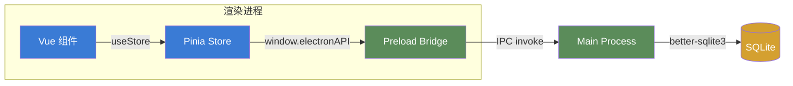

### 6.2 Store 列表

| Store | 文件 | 职责 | 变更 |
|-------|------|------|------|
| `useCoursesStore` | stores/courses.ts | 课程列表、章节加载、分类筛选 | v1.1 `setCurrentCategory`；🆕 v1.2 `loadChapters` 解析 resources JSON 字段为 ChapterResource[] |
| `usePracticeStore` | stores/practice.ts | 任务加载、代码保存/提交验证、AI 聊天、计时 | v1.1 Web Worker 执行 + 分步引导 + 测试结果 |
| `useProgressStore` | stores/progress.ts | 仪表盘数据、每日统计、课程完成度、任务统计 | — |
| `useUserStore` | stores/user.ts | 用户昵称、学习目标、提醒设置 | v1.1 LLM 配置字段（apiKey/baseUrl/model） |

### 6.3 PracticeStore 详细说明

`usePracticeStore` 在 v1.1 中新增了以下能力：

| 新增状态/方法 | 类型 | 说明 |
|---------------|------|------|
| `currentStepIndex` | `ref<number>` | 当前分步引导步骤索引 |
| `lastRunResult` | `ref<RunResult \| null>` | 最近一次测试运行结果 |
| `isRunning` | `ref<boolean>` | 是否正在执行测试 |
| `currentSteps` | `computed<TaskStep[]>` | 当前任务的步骤列表（已 JSON 解析） |
| `currentTestCases` | `computed<TestCase[]>` | 当前任务的测试用例（已 JSON 解析） |
| `isTestTask` | `computed<boolean>` | 是否为测试型任务（`validationType === 'tests'`） |
| `runCodeViaWorker()` | 方法 | 通过 Web Worker 执行代码（5 秒超时） |
| `nextStep/prevStep/goToStep()` | 方法 | 分步引导导航 |
| `resetCode()` | 方法 | 重置代码为初始模板 |
| `clearRunResult()` | 方法 | 清空测试结果 |

### 6.4 🆕 v1.2 CoursesStore.loadChapters 资源解析

```typescript
async function loadChapters(courseId: number) {
  const rows = await window.electronAPI.dbQuery(
    'SELECT * FROM chapters WHERE course_id = ? ORDER BY sort_order',
    [courseId]
  )
  // 解析 resources JSON 字段为 ChapterResource[] 数组
  const parsed = rows.map((row: any) => ({
    ...row,
    resources: row.resources ? (JSON.parse(row.resources) as ChapterResource[]) : null
  })) as Chapter[]
  chapters.value.set(courseId, parsed)
}
```

---

## 七、数据库设计

**引擎**: SQLite (WAL 模式) | **文件**: `user-data/ai-coding-learner.db`

> v1.1 数据库迁移：`tasks` 表新增 5 列（steps/test_cases/function_name/hint/is_guided_project）；`user_config` 表新增 3 列（llm_api_key/llm_base_url/llm_model）。旧库启动时会自动检测并 DROP 重建 tasks 表。
>
> 🆕 **v1.2 数据库迁移**：`chapters` 表新增 `resources` 列（TEXT，存储 JSON 数组）。15 章全部补充真实 B 站 BV 号；6 个任务的所有 steps 项扩展 `referenceCode` 和 `expectedResult` 字段。旧库启动时若 chapters 缺 resources 列会自动 DROP 重建。

### 7.1 ER 图

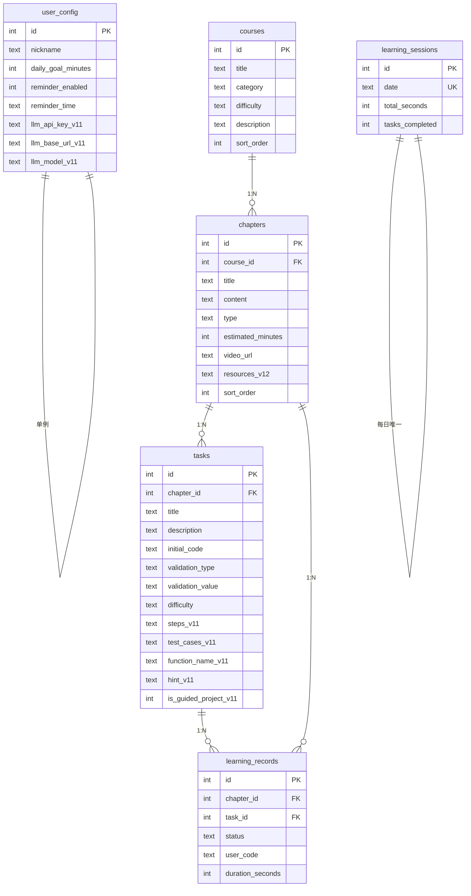

> 表中 `_v11` 标记为 v1.1 新增列，`_v12` 标记为 v1.2 新增列。

### 7.2 v1.1 新增字段说明

**tasks 表新增列**：

| 列名 | 类型 | 说明 |
|------|------|------|
| `steps` | TEXT (JSON) | 分步引导步骤数组，每项含 title/description/hint |
| `test_cases` | TEXT (JSON) | 单元测试用例数组，每项含 name/input/expected/mode |
| `function_name` | TEXT | 需要测试的目标函数名 |
| `hint` | TEXT | 任务整体提示 |
| `is_guided_project` | INTEGER | 1=综合实战引导项目，0=普通任务 |

**user_config 表新增列**：

| 列名 | 类型 | 默认值 | 说明 |
|------|------|--------|------|
| `llm_api_key` | TEXT | NULL | OpenAI 兼容 API 密钥 |
| `llm_base_url` | TEXT | `https://api.openai.com` | API 基础地址 |
| `llm_model` | TEXT | `gpt-3.5-turbo` | 模型名称 |

### 7.3 🆕 v1.2 新增字段说明

**chapters 表新增列**：

| 列名 | 类型 | 说明 |
|------|------|------|
| `resources` | TEXT (JSON) | 配套学习资源数组，每项含 title/url。每章 4 条 |

**chapters 表数据更新**（15 章视频）：

| 课程 | 章节 | BV 号 |
|------|------|-------|
| Agent 基础（3 章） | 第 1-3 章 | BV1XiTkzVE4X |
| Prompt Engineering（3 章） | 第 4-6 章 | BV1Z7ZwYHENT |
| Tool Calling（3 章） | 第 7-9 章 | BV1z95LzaE39 |
| Agent 工作流（2 章） | 第 10-11 章 | BV1mXZyYtEZS |
| 多 Agent 协作（2 章） | 第 12-13 章 | BV17XP5eBE15 |
| RAG 技术（2 章） | 第 14-15 章 | BV1c1oxYtEZM |

**tasks 表 steps JSON 字段扩展**：每个步骤对象新增两个可选字段
- `referenceCode`: string — 该步骤的参考代码示例
- `expectedResult`: string — 该步骤完成后的预期效果描述

### 7.4 🆕 v1.2.1 新增 app_meta 表与版本驱动迁移

**新增 `app_meta` 表**（数据版本管理）：

| 列名 | 类型 | 说明 |
|------|------|------|
| `key` | TEXT PRIMARY KEY | 元数据键名，目前仅 `data_version` |
| `value` | TEXT NOT NULL | 元数据值，如 `1.2.1` |

**seedData 版本驱动逻辑**（修复 v1.2.0 升级不刷新 bug）：

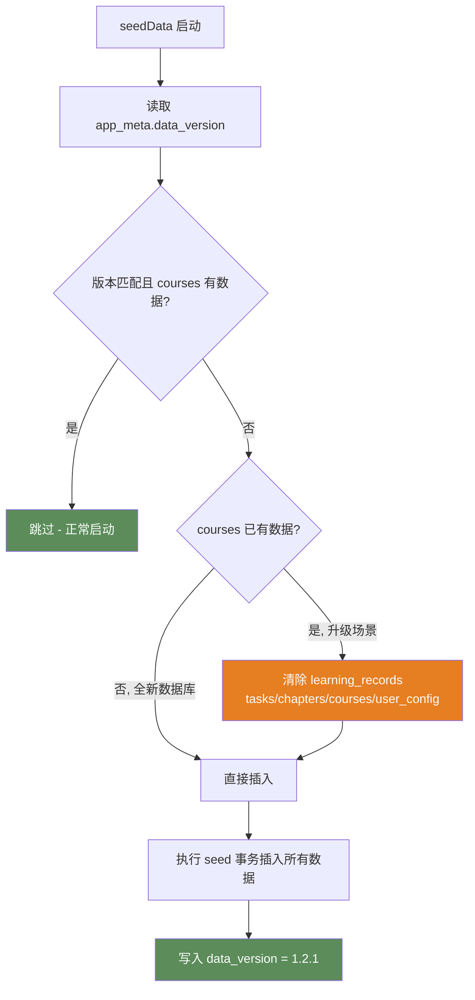

> 此修复解决了 v1.2.0 的严重 bug：旧版 `seedData` 仅检查 `courses.count > 0` 就早返回，导致从 v1.1.0/v1.2.0 升级时新的章节视频、配套资源、任务引导数据无法写入。

### 7.5 种子数据

| 表 | 记录数 | 说明 | 变更 |
|----|--------|------|------|
| courses | 6 | Agent 基础、Prompt、Tool Calling、工作流、多 Agent、RAG | — |
| chapters | 15 | 理论 10 章 + 实操 5 章，每章含 Markdown 内容 | 🆕 v1.2 全部补充真实 B 站 BV 号 + 4 个 resources |
| tasks | 6 | 5 个核心任务 + 1 个综合实战引导项目 | v1.1 含 steps/test_cases/function_name；🆕 v1.2 steps 扩展 referenceCode/expectedResult |
| user_config | 1 | 默认昵称"学习者"，目标 30 分钟/天 | v1.1 含 LLM 默认配置 |
| app_meta | 1 | `data_version = 1.2.1` | 🆕 v1.2.1 新增 |

---

## 八、IPC 通信协议

### 通道列表

| 通道 | 方向 | 请求 | 响应 |
|------|------|------|------|
| `db:query` | Renderer → Main | `{ sql, params }` | 查询结果数组 |
| `db:execute` | Renderer → Main | `{ sql, params }` | `{ changes, lastInsertRowid }` |
| `fs:read-course` | Renderer → Main | `{ path }` | 文件内容字符串 |
| `fs:save-code` | Renderer → Main | `{ taskId, code }` | 无返回值 |
| `app:get-version` | Renderer → Main | 无 | 版本号字符串 |

### 安全措施

- `contextIsolation: true` — 渲染进程无法直接访问 Node.js API
- `nodeIntegration: false` — 禁止在渲染进程中使用 require
- `db:query` 仅允许 `SELECT` 语句，防止 SQL 注入
- 所有数据通过 `contextBridge.exposeInMainWorld` 安全暴露

---

## 九、核心功能流程

### 9.1 学习时长统计流程

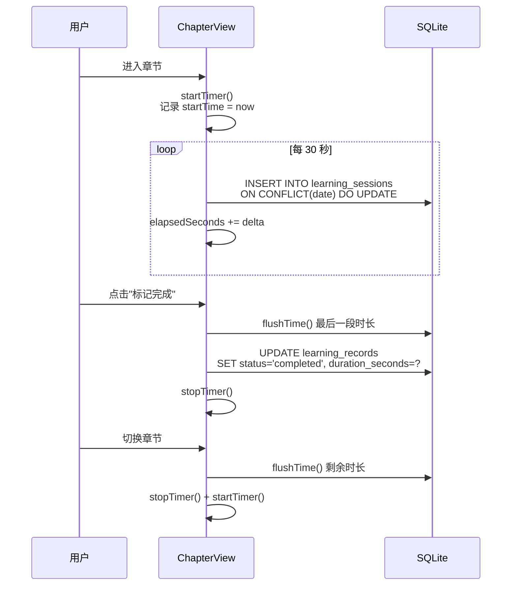

### 9.2 代码提交验证流程（v1.0 旧版，适用于 contains/exact/regex）

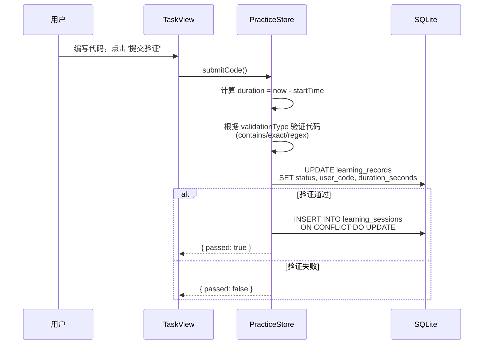

### 9.3 v1.1 Web Worker 代码执行流程（适用于 tests 类型任务）

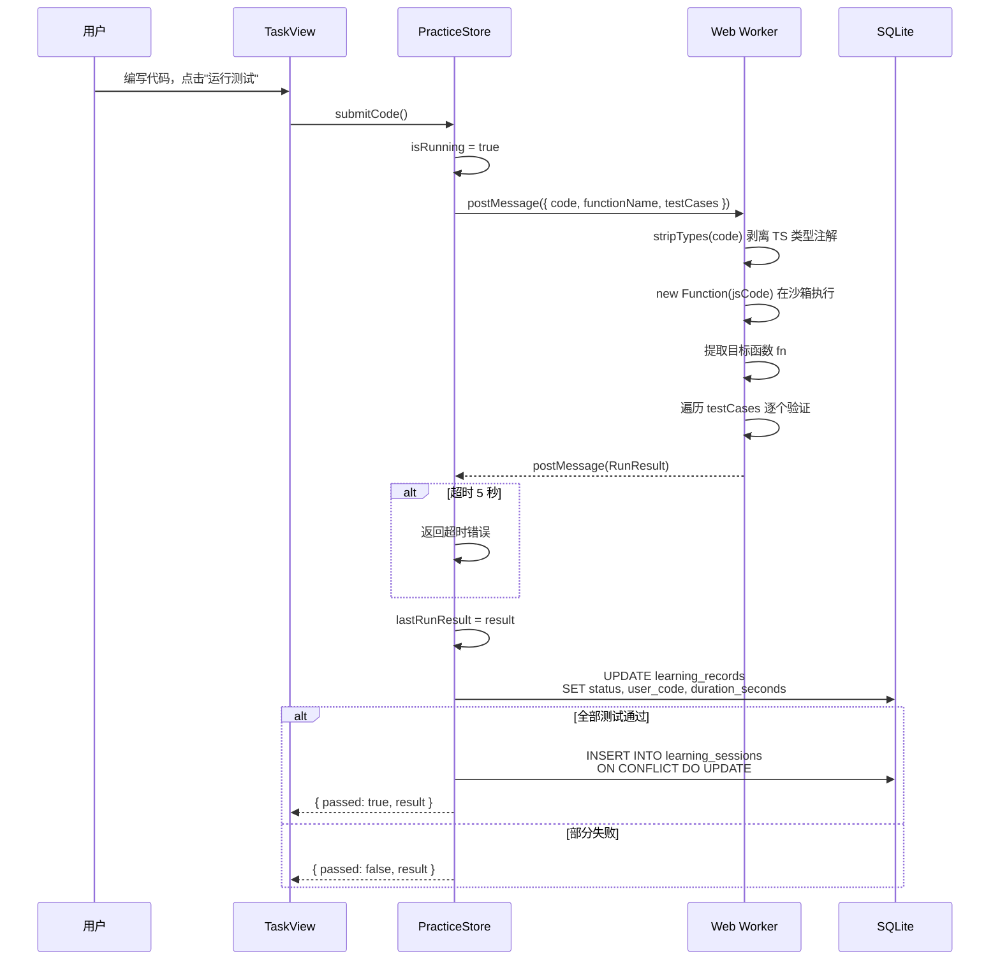

### 9.4 v1.1 LLM 助手对话流程

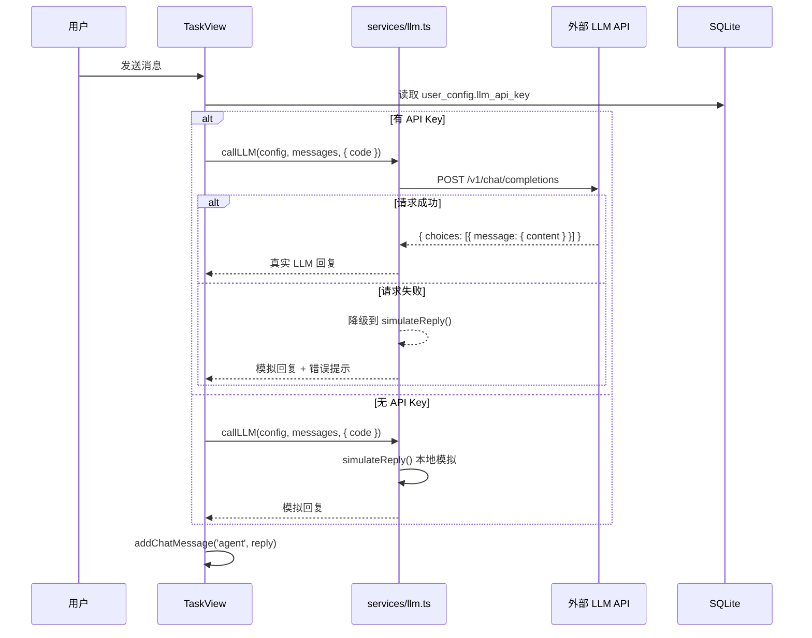

---

## 十、构建与打包

### 10.1 开发模式

```bash
npm run dev
```

Vite 开发服务器 + Electron 窗口，支持热更新。

### 10.2 生产构建

```bash
# TypeScript 类型检查 + Vite 构建
npm run build

# Electron 打包（Windows NSIS / macOS DMG / Linux AppImage）
npm run electron:build
```

### 10.3 Vite 配置

| 配置项 | 值 | 说明 |
|--------|-----|------|
| `@` 别名 | `src/` | 简化导入路径 |
| electron 入口 | `electron/main.ts` | 编译到 `dist-electron/` |
| preload 入口 | `electron/preload.ts` | 编译到 `dist-electron/` |
| external | `better-sqlite3` | 原生模块不打包 |
| renderer 插件 | `vite-plugin-electron-renderer` | 渲染进程 Node 支持 |

### 10.4 Electron Builder 打包配置

| 配置项 | 值 |
|--------|-----|
| appId | `com.ai-coding-learner` |
| Windows 目标 | NSIS 安装包 |
| macOS 目标 | DMG 镜像 |
| Linux 目标 | AppImage |
| asar 解压 | `**/*.node`, `**/better-sqlite3/**` |

---

## 十一、类型系统

**文件**: `src/types/index.ts`

定义 TypeScript 接口/类型（v1.0 原始 12 个 + v1.1 新增 3 个 + 🆕 v1.2 新增 1 个）：

| 类型 | 说明 | 变更 |
|------|------|------|
| `Course` | 课程（id, title, category, difficulty, description） | — |
| `CourseCategory` | 课程分类：basics / agent / practice / advanced | — |
| `Difficulty` | 难度：beginner / intermediate / advanced | — |
| `Chapter` | 章节（id, courseId, title, content, type, videoUrl） | 🆕 v1.2 新增 `resources: ChapterResource[] \| null` |
| `ChapterType` | 章节类型：theory / practice | — |
| **`ChapterResource`** | **章节配套资源（title, url）** | **🆕 v1.2 新增** |
| `Task` | 实操任务（id, chapterId, validationType, initialCode） | v1.1 新增 steps/testCases/functionName/hint/isGuidedProject |
| `ValidationType` | 验证类型：exact / contains / regex / custom | v1.1 新增 `tests` |
| `TaskStep` | 分步引导步骤（title, description, hint） | v1.1 新增；🆕 v1.2 扩展 referenceCode/expectedResult |
| `TestCase` | 测试用例（name, input, expected, mode, description） | v1.1 新增 |
| `RunResult` | 代码运行结果（passed, totalTests, passedTests, results, consoleOutput） | v1.1 新增 |
| `LearningRecord` | 学习记录（chapterId, taskId, status, durationSeconds） | — |
| `LearningSession` | 学习会话（date, totalSeconds, tasksCompleted） | — |
| `UserConfig` | 用户配置（nickname, dailyGoalMinutes, reminderEnabled） | v1.1 新增 llmApiKey/llmBaseUrl/llmModel |
| `ChatMessage` | AI 对话消息（id, role, content, timestamp） | — |
| `DashboardStats` | 首页统计（todayMinutes, streakDays, lastChapter） | — |
| `ProgressData` | 进度数据（dailyStats, courseCompletion, taskStats） | — |

### v1.1 新增类型定义

```typescript
// 实操任务步骤（用于分步引导）
export interface TaskStep {
  title: string
  description: string
  hint: string
}

// 测试用例（用于真实代码执行验证）
export interface TestCase {
  name: string
  input: any[]
  expected: any
  mode?: 'equal' | 'contains' | 'length' | 'throws'
  description?: string
}

// 代码运行结果
export interface RunResult {
  passed: boolean
  totalTests: number
  passedTests: number
  results: Array<{
    name: string
    passed: boolean
    expected: string
    actual: string
    error?: string
  }>
  consoleOutput: string[]
  error?: string
}
```

### 🆕 v1.2 新增/扩展类型定义

```typescript
// 章节配套资源（v1.2 新增）
export interface ChapterResource {
  title: string
  url: string
}

// Chapter 接口扩展
export interface Chapter {
  // ... 原有字段 ...
  resources: ChapterResource[] | null  // 🆕 v1.2 新增
}

// TaskStep 扩展（v1.2 新增可选字段）
export interface TaskStep {
  title: string
  description: string
  hint: string
  referenceCode?: string      // 🆕 v1.2 新增：该步骤的参考代码示例
  expectedResult?: string     // 🆕 v1.2 新增：该步骤完成后的预期效果
}
```

---

## 十二、设计系统

### 主题色

| 颜色 | CSS 变量 | 值 |
|------|----------|-----|
| 主色（竹绿） | `--color-primary` | `#5B8C5A` |
| 主色悬停 | `--color-primary-hover` | `#4A7A49` |
| 背景色 | `--color-bg` | `#F7F9F5` |
| 卡片背景 | `--color-bg-card` | `#FFFFFF` |
| 成功色 | `--color-success` | `#5B8C5A` |
| 边框色 | `--color-border-light` | `#E8EDE4` |

### 组件库

16 个 Vue 组件，分为 5 个层级：

- **layout**: AppLayout, AppSidebar, AppHeader
- **common**: ProgressBar, StatCard, EmptyState, LoadingSpinner
- **learn**: CourseCard, ChapterTree, ContentViewer
- **practice**: CodeEditor, TaskPanel（🆕 v1.2 预期效果+参考代码）, AiChatSimulator
- **progress**: DurationChart, CalendarHeatmap, WeeklyReport

---

## 十三、v1.2 变更日志

### 13.1 v1.2 变更总览

| 模块 | 变更类型 | 说明 |
|------|----------|------|
| 学习中心 | 数据补全 | 15 章节全部补充真实 B 站 BV 号 |
| 学习中心 | 新增字段 | chapters 表新增 resources 列，每章 4 个配套学习资源 |
| 实操实验室 | 引导增强 | 6 任务的所有 steps 扩展 referenceCode + expectedResult |
| 实操实验室 | UI 修复 | 右侧面板改为「上滚动 + 下固定」布局，按钮不再被截断 |
| 类型系统 | 新增 | ChapterResource 接口；TaskStep 扩展 referenceCode/expectedResult |
| 状态管理 | 增强 | CoursesStore.loadChapters 解析 resources JSON |

### 13.2 v1.2 文件变更清单

**修改文件**（6 个）：

| 文件 | 主要变更 |
|------|----------|
| `electron/database.ts` | chapters 表新增 resources 列；15 章 BV 号 + 4 resources；6 任务 steps 扩展 referenceCode/expectedResult；旧库 chapters 缺 resources 列时自动 DROP 重建 |
| `src/types/index.ts` | 新增 ChapterResource 接口；Chapter 扩展 resources 字段；TaskStep 扩展 referenceCode/expectedResult |
| `src/stores/courses.ts` | loadChapters 解析 resources JSON 字段为 ChapterResource[] |
| `src/views/ChapterView.vue` | 新增「配套学习资源」列表区域（4 条链接，hover 效果） |
| `src/views/TaskView.vue` | 右侧面板重构：`.task-right-content` 可滚动 + `.task-actions-bar` 固定底部 |
| `src/components/practice/TaskPanel.vue` | 新增预期效果卡片（绿色）+ 参考代码切换按钮（暗色代码块） |
| `package.json` | 版本号 1.1.0 → 1.2.0 |
| `src/views/SettingsView.vue` | 关于信息版本 1.1.0 → 1.2.0 |

### 13.3 v1.2 数据库迁移策略（⚠️ 已被 v1.2.1 替换）

> **⚠️ 此迁移策略存在严重 bug**：当 `courses.count > 0` 时 seedData 早返回，导致升级时 chapters/tasks 新数据无法写入。v1.2.1 已用版本号驱动迁移替换此逻辑（见第十五章）。

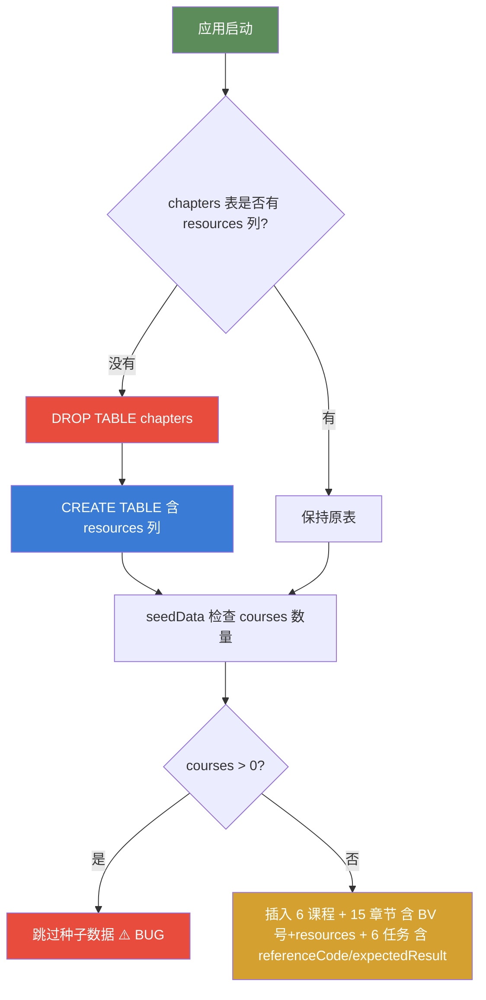

### 13.4 v1.2 TaskView 布局修复方案

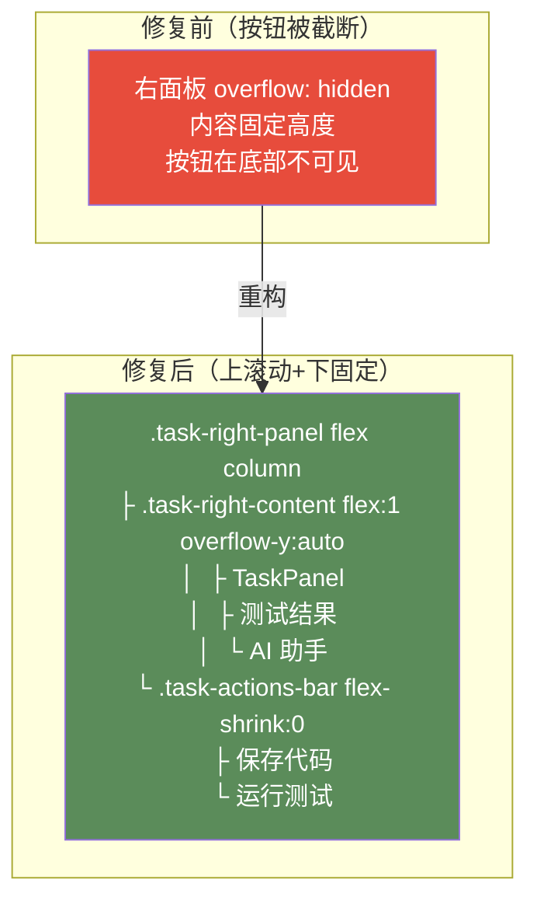

### 13.5 v1.2 打包与发布

v1.2 打包命令：
```bash
npm run build    # TypeScript 类型检查 + Vite 构建
npm run pack     # electron-builder 打包（输出到 release/）
```

打包产物：
- `release/AI Coding Learner 1.2.0.exe` — 便携版单文件（89.4 MB）
- `release/AI Coding Learner-1.2.0-win.zip` — 解压版（148.27 MB）
- `release/win-unpacked/AI Coding Learner.exe` — 解压目录版本

> 版本号已同步更新至 `package.json` 的 `version: 1.2.0`，设置页关于信息也已同步。
>
> ⚠️ v1.2.0 存在升级数据不刷新 bug，已被 v1.2.1 替代，详见第十五章。

---

## 十四、v1.1 变更日志（历史）

### 14.1 变更总览

| 模块 | 变更类型 | 说明 |
|------|----------|------|
| 实操实验室 | 重大升级 | Monaco 编辑器 + Web Worker + 分步引导 + LLM 接入 |
| 数据库 | 扩展 | tasks 表 +5 列，user_config 表 +3 列 |
| 类型系统 | 新增 | TaskStep / TestCase / RunResult |
| 服务层 | 新增 | src/services/llm.ts |
| Web Worker | 新增 | src/workers/code-runner.ts |
| 主进程 | 增强 | 启动日志 + 错误对话框 |
| 状态管理 | 增强 | PracticeStore 新增 Web Worker 执行 + 分步引导 |

### 14.2 文件变更清单

**新增文件**（2 个）：
- `src/services/llm.ts` — LLM 服务（OpenAI 兼容 + 模拟回退）
- `src/workers/code-runner.ts` — Web Worker 代码沙箱

**修改文件**（8 个）：
| 文件 | 主要变更 |
|------|----------|
| `electron/main.ts` | 新增启动日志、数据库错误对话框 |
| `electron/database.ts` | tasks 表扩展 5 列、user_config 扩展 3 列、logError 函数、数据验证日志 |
| `src/types/index.ts` | 新增 TaskStep/TestCase/RunResult；Task 接口扩展；UserConfig 扩展 LLM 字段 |
| `src/stores/practice.ts` | 新增 Web Worker 执行、分步引导、测试结果管理 |
| `src/stores/courses.ts` | 新增 setCurrentCategory 方法 |
| `src/stores/user.ts` | 新增 LLM 配置字段 |
| `src/components/practice/CodeEditor.vue` | 替换为 Monaco Editor（vs-dark 主题、TS 高亮、格式化、重置） |
| `src/components/practice/TaskPanel.vue` | 新增分步引导进度条、步骤导航、提示显示 |
| `src/components/practice/AiChatSimulator.vue` | 新增真实 LLM/模拟模式切换标签、代码上下文发送 |
| `src/views/TaskView.vue` | 重构为左右双栏布局（Monaco + 任务面板 + 测试结果 + AI 助手） |
| `src/views/PracticeView.vue` | 任务卡片显示难度/测试数/引导步数/引导项目标签 |
| `src/views/SettingsView.vue` | 新增 LLM API Key/Base URL/Model 配置表单 |
| `src/views/ChapterView.vue` | 修复 video_url → videoUrl |
| `src/views/LearnView.vue` | 修复分类类型错误，使用 setCurrentCategory |
| `src/components/learn/ContentViewer.vue` | 添加 MarkdownIt 和 highlight 类型注解 |

### 14.3 v1.1 数据库迁移策略

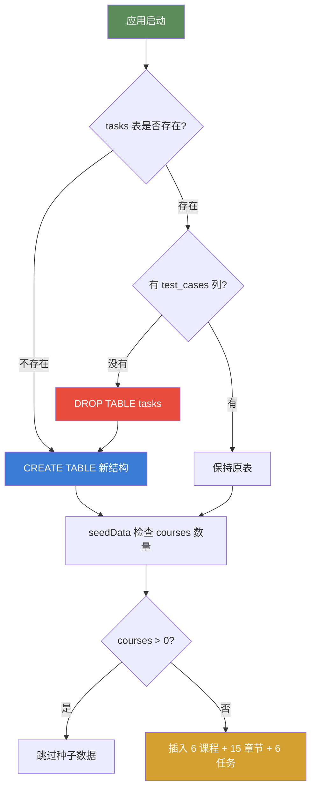

---

## 十五、v1.2.1 变更日志（数据库迁移修复）

### 15.1 问题背景

v1.2.0 发布后用户反馈：从 v1.1.0 升级到 v1.2.0 后，前 3 项改进（B 站视频、配套资源、任务引导）均未生效，只有第 4 项（UI 布局修复）可见。

### 15.2 根本原因

[electron/database.ts](file:///d:/ai/6a5dd856e73672a131495d9d/electron/database.ts) 中的 `seedData()` 函数存在早返回 bug：

```typescript
// v1.2.0 的有 bug 代码
function seedData(): void {
  const count = db.prepare('SELECT COUNT(*) as count FROM courses').get()
  if (count.count > 0) return  // ← BUG：升级时 courses 已有数据，直接跳过
  // ... 新的章节/任务数据永远不会被插入 ...
}
```

升级时执行流程：
1. 旧数据库已有 6 条 courses 记录
2. createTables 可能 DROP + 重建 chapters 表（空表）
3. seedData 检查 `courses.count > 0` → 返回
4. chapters/tasks 表保持空或旧数据，v1.2.0 新数据无法写入

### 15.3 修复方案：版本号驱动迁移

新增 `app_meta` 表存储数据版本，seedData 改为版本号驱动：

| 文件 | 变更 |
|------|------|
| `electron/database.ts` | 新增 `app_meta` 表；新增 `CURRENT_DATA_VERSION`/`getDataVersion`/`setDataVersion`；重写 `seedData` 版本检查逻辑 |
| `package.json` | 版本号 1.2.0 → 1.2.1 |
| `src/views/SettingsView.vue` | 关于信息 v1.2.0 → v1.2.1 |
| `README.md` | 新增 v1.2.1 更新说明 |
| `使用文档.md` | 版本号同步 |
| `系统架构文档.md` | 新增第十五章；7.4 节说明 app_meta 表 |

### 15.4 修复后的迁移流程

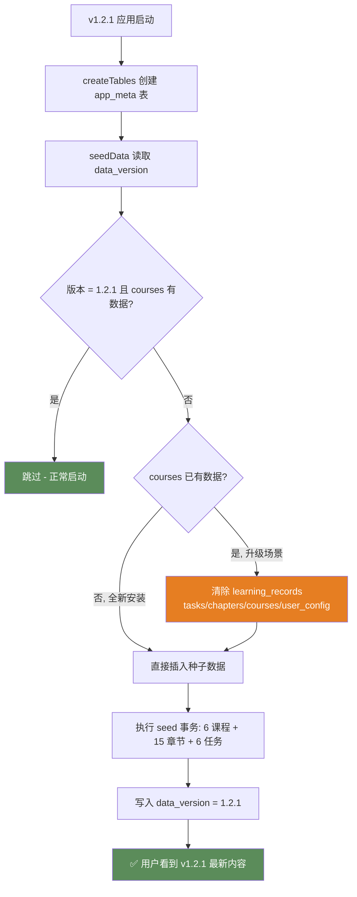

### 15.5 10 条测试用例验证

| # | 场景 | 输入条件 | 预期结果 |
|---|------|----------|----------|
| 1 | 全新安装 | 无数据库文件 | 创建所有表 + 插入 6 课程/15 章节/6 任务 + data_version=1.2.1 |
| 2 | v1.2.1 正常重启 | data_version=1.2.1, courses=6 | 跳过 seedData，数据不变 |
| 3 | v1.1.0 升级 | 无 app_meta, courses=6(旧) | 清除旧数据 → 重新插入 → data_version=1.2.1 |
| 4 | v1.2.0 升级 | 无 app_meta, courses=6(旧), chapters 无 resources | 清除旧数据 → 重新插入 → data_version=1.2.1 |
| 5 | v1.2.0 升级（chapters 已有 resources） | 无 app_meta, courses=6, chapters 有 resources | 清除旧数据 → 重新插入 → data_version=1.2.1 |
| 6 | 学习时长保留 | learning_sessions 有记录 | 升级后 learning_sessions 保留 |
| 7 | 用户配置重置 | user_config 有自定义昵称 | 升级后重置为默认"学习者" |
| 8 | 学习记录清除 | learning_records 有章节记录 | 升级后清除（因 chapter_id 可能变化） |
| 9 | 数据库损坏恢复 | app_meta 存在但 chapters 空 | courseCount=0 → 直接插入 → data_version=1.2.1 |
| 10 | 未来 v1.3 升级 | data_version=1.2.1, courses=6 | 版本不匹配 → 清除 → 重新插入 → data_version=新版本 |