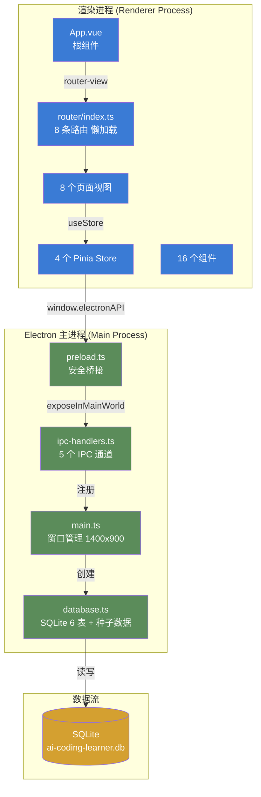
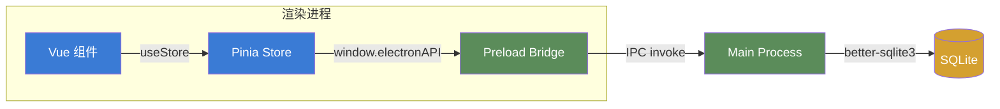
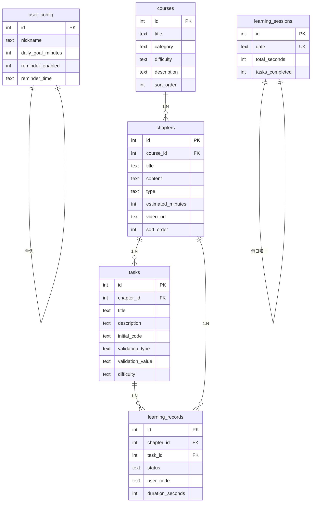
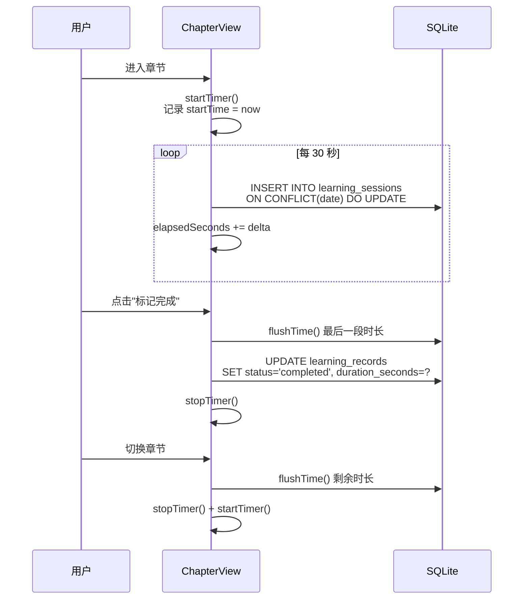
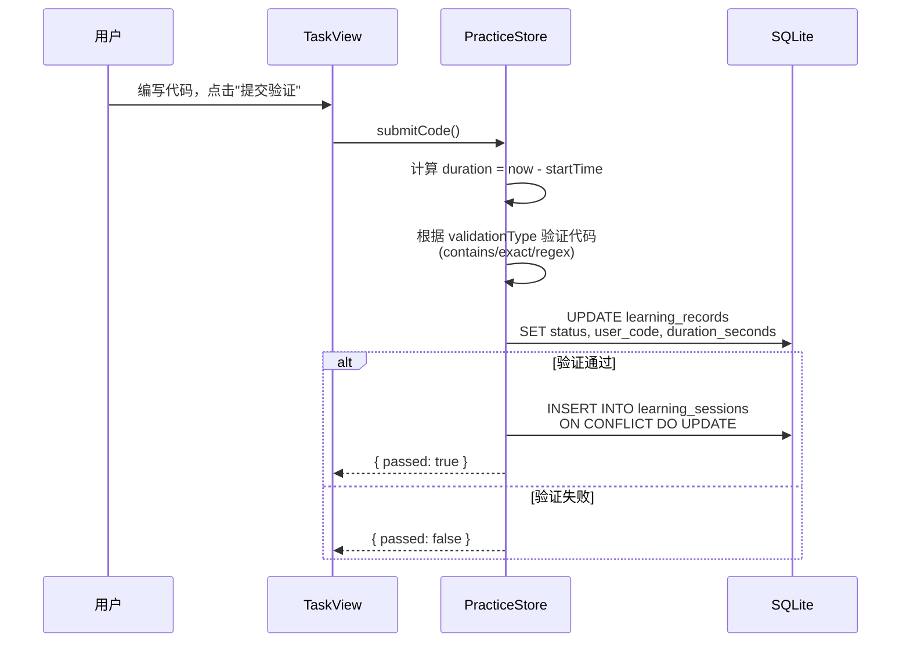

# AI Coding Learner 系统架构文档

> 版本 1.0.0 | 技术栈：Electron 28 + Vue 3 + TypeScript + SQLite

---

## 一、项目概述

AI Coding Learner 是一款基于 Electron 的桌面学习应用，采用前后端分离的双进程架构。前端使用 Vue 3 Composition API 构建 SPA 界面，后端通过 Electron 主进程管理 SQLite 数据库和系统级操作。

### 技术栈

| 层级 | 技术 | 版本 |
|------|------|------|
| 桌面框架 | Electron | 28.x |
| 前端框架 | Vue 3 | 3.4.x |
| 类型系统 | TypeScript | 5.3.x |
| 构建工具 | Vite | 5.1.x |
| 状态管理 | Pinia | 2.1.x |
| 路由 | Vue Router | 4.3.x |
| 数据库 | better-sqlite3 | 11.x |
| Markdown 渲染 | markdown-it + highlight.js | 14.x / 11.x |
| 打包工具 | electron-builder | 24.x |
| Electron 插件 | vite-plugin-electron | 0.28.x |

---

## 二、系统架构总览



---

## 三、目录结构

```
ai-coding-learner/
├── electron/                    # Electron 主进程代码
│   ├── main.ts                  # 应用入口，窗口创建 (1400x900)
│   ├── preload.ts               # 安全桥接层 (contextBridge)
│   ├── database.ts              # SQLite 数据库初始化 + 种子数据
│   └── ipc-handlers.ts          # IPC 通信处理器 (5 个通道)
│
├── src/                         # 渲染进程（Vue 前端）
│   ├── App.vue                  # 根组件
│   ├── main.ts                  # Vue 应用入口
│   ├── env.d.ts                 # TypeScript 类型声明
│   ├── types/
│   │   └── index.ts             # 12 个 TS 接口/类型定义
│   ├── router/
│   │   └── index.ts             # 8 条路由（全部懒加载）
│   ├── stores/                  # Pinia 状态管理
│   │   ├── user.ts              # 用户配置
│   │   ├── courses.ts           # 课程 + 章节
│   │   ├── practice.ts          # 实操任务 + 计时
│   │   └── progress.ts          # 学习统计
│   ├── views/                   # 页面视图 (8 个)
│   │   ├── HomeView.vue         # 首页仪表盘
│   │   ├── LearnView.vue        # 课程列表
│   │   ├── CourseDetailView.vue # 课程详情
│   │   ├── ChapterView.vue      # 章节学习（核心页面）
│   │   ├── PracticeView.vue     # 任务列表
│   │   ├── TaskView.vue         # 任务编辑器
│   │   ├── ProgressView.vue     # 学习统计
│   │   └── SettingsView.vue     # 用户设置
│   ├── components/              # 公共组件 (16 个)
│   │   ├── common/              # 通用组件 (4 个)
│   │   │   ├── ProgressBar.vue
│   │   │   ├── StatCard.vue
│   │   │   ├── EmptyState.vue
│   │   │   └── LoadingSpinner.vue
│   │   ├── layout/              # 布局组件 (3 个)
│   │   │   ├── AppLayout.vue
│   │   │   ├── AppSidebar.vue
│   │   │   └── AppHeader.vue
│   │   ├── learn/               # 学习组件 (3 个)
│   │   │   ├── CourseCard.vue
│   │   │   ├── ChapterTree.vue
│   │   │   └── ContentViewer.vue
│   │   ├── practice/            # 实操组件 (3 个)
│   │   │   ├── CodeEditor.vue
│   │   │   ├── TaskPanel.vue
│   │   │   └── AiChatSimulator.vue
│   │   └── progress/            # 统计组件 (3 个)
│   │       ├── DurationChart.vue
│   │       ├── CalendarHeatmap.vue
│   │       └── WeeklyReport.vue
│   └── assets/
│       └── styles/
│           ├── variables.css    # 50+ CSS 设计令牌（竹绿色主题）
│           └── global.css       # 全局样式 + 工具类
│
├── docs/                        # 文档目录
│   ├── 使用文档.md
│   └── 系统架构文档.md
│
├── start.bat                    # Windows 一键启动脚本
├── create-shortcut.ps1          # 桌面快捷方式创建脚本
├── package.json                 # 项目配置 + 依赖
├── vite.config.ts               # Vite + Electron 插件配置
├── tsconfig.json                # TypeScript 配置
├── tsconfig.node.json           # Node 端 TypeScript 配置
└── electron-builder.yml         # 打包配置
```

---

## 四、双进程架构

### 4.1 主进程 (Main Process)

**文件**: `electron/main.ts`

负责：
- 创建 BrowserWindow（1400x900，最小 1024x680）
- 初始化 SQLite 数据库
- 注册 IPC 通信处理器
- 管理应用生命周期

```typescript
// 窗口配置
new BrowserWindow({
  width: 1400, height: 900,
  minWidth: 1024, minHeight: 680,
  webPreferences: {
    preload: path.join(__dirname, 'preload.js'),
    contextIsolation: true,    // 安全隔离
    nodeIntegration: false     // 禁用 Node 集成
  }
})
```

### 4.2 预加载脚本 (Preload Script)

**文件**: `electron/preload.ts`

通过 `contextBridge` 安全暴露 5 个 API 给渲染进程：

| API | 类型 | 用途 |
|-----|------|------|
| `dbQuery(sql, params)` | invoke | 执行 SELECT 查询 |
| `dbExecute(sql, params)` | invoke | 执行 INSERT/UPDATE/DELETE |
| `readCourseFile(path)` | invoke | 读取课程文件 |
| `saveCode(taskId, code)` | invoke | 保存用户代码 |
| `getAppVersion()` | invoke | 获取应用版本 |

### 4.3 渲染进程 (Renderer Process)

基于 Vue 3 + TypeScript 的 SPA 应用，通过 `window.electronAPI` 与主进程通信。

---

## 五、路由设计

使用 `createMemoryHistory`（适配 Electron 环境），8 条路由全部懒加载。

| 路径 | 名称 | 视图 | 说明 |
|------|------|------|------|
| `/` | home | HomeView | 首页仪表盘 |
| `/learn` | learn | LearnView | 课程列表（支持分类筛选） |
| `/learn/:courseId` | course-detail | CourseDetailView | 课程详情 + 章节列表 |
| `/learn/:courseId/:chapterId` | chapter | ChapterView | 章节学习（核心） |
| `/practice` | practice | PracticeView | 实操任务列表 |
| `/practice/:taskId` | task | TaskView | 任务编辑器 |
| `/progress` | progress | ProgressView | 学习统计 |
| `/settings` | settings | SettingsView | 用户设置 |

---

## 六、状态管理 (Pinia Stores)

### 6.1 数据流



### 6.2 Store 列表

| Store | 文件 | 职责 |
|-------|------|------|
| `useCoursesStore` | stores/courses.ts | 课程列表、章节加载、分类筛选 |
| `usePracticeStore` | stores/practice.ts | 任务加载、代码保存/提交验证、AI 聊天、计时 |
| `useProgressStore` | stores/progress.ts | 仪表盘数据、每日统计、课程完成度、任务统计 |
| `useUserStore` | stores/user.ts | 用户昵称、学习目标、提醒设置 |

---

## 七、数据库设计

**引擎**: SQLite (WAL 模式) | **文件**: `user-data/ai-coding-learner.db`

### 7.1 ER 图



### 7.2 种子数据

| 表 | 记录数 | 说明 |
|----|--------|------|
| courses | 6 | Agent 基础、Prompt、Tool Calling、工作流、多 Agent、RAG |
| chapters | 15 | 理论 10 章 + 实操 5 章，每章含 Markdown 内容 + 视频链接 |
| tasks | 5 | 5 个实操任务，3 种验证方式（contains/exact/regex） |
| user_config | 1 | 默认昵称"学习者"，目标 30 分钟/天 |

---

## 八、IPC 通信协议

### 通道列表

| 通道 | 方向 | 请求 | 响应 |
|------|------|------|------|
| `db:query` | Renderer → Main | `{ sql, params }` | 查询结果数组 |
| `db:execute` | Renderer → Main | `{ sql, params }` | `{ changes, lastInsertRowid }` |
| `fs:read-course` | Renderer → Main | `{ path }` | 文件内容字符串 |
| `fs:save-code` | Renderer → Main | `{ taskId, code }` | 无返回值 |
| `app:get-version` | Renderer → Main | 无 | 版本号字符串 |

### 安全措施

- `contextIsolation: true` — 渲染进程无法直接访问 Node.js API
- `nodeIntegration: false` — 禁止在渲染进程中使用 require
- `db:query` 仅允许 `SELECT` 语句，防止 SQL 注入
- 所有数据通过 `contextBridge.exposeInMainWorld` 安全暴露

---

## 九、核心功能流程

### 9.1 学习时长统计流程



### 9.2 代码提交验证流程



---

## 十、构建与打包

### 10.1 开发模式

```bash
npm run dev
```

Vite 开发服务器 + Electron 窗口，支持热更新。

### 10.2 生产构建

```bash
# TypeScript 类型检查 + Vite 构建
npm run build

# Electron 打包（Windows NSIS / macOS DMG / Linux AppImage）
npm run electron:build
```

### 10.3 Vite 配置

| 配置项 | 值 | 说明 |
|--------|-----|------|
| `@` 别名 | `src/` | 简化导入路径 |
| electron 入口 | `electron/main.ts` | 编译到 `dist-electron/` |
| preload 入口 | `electron/preload.ts` | 编译到 `dist-electron/` |
| external | `better-sqlite3` | 原生模块不打包 |
| renderer 插件 | `vite-plugin-electron-renderer` | 渲染进程 Node 支持 |

### 10.4 Electron Builder 打包配置

| 配置项 | 值 |
|--------|-----|
| appId | `com.ai-coding-learner` |
| Windows 目标 | NSIS 安装包 |
| macOS 目标 | DMG 镜像 |
| Linux 目标 | AppImage |
| asar 解压 | `**/*.node`, `**/better-sqlite3/**` |

---

## 十一、类型系统

**文件**: `src/types/index.ts`

定义了 12 个 TypeScript 接口/类型：

| 类型 | 说明 |
|------|------|
| `Course` | 课程（id, title, category, difficulty, description） |
| `CourseCategory` | 课程分类：basics / agent / practice / advanced |
| `Difficulty` | 难度：beginner / intermediate / advanced |
| `Chapter` | 章节（id, courseId, title, content, type, videoUrl） |
| `ChapterType` | 章节类型：theory / practice |
| `Task` | 实操任务（id, chapterId, validationType, initialCode） |
| `ValidationType` | 验证类型：exact / contains / regex / custom |
| `LearningRecord` | 学习记录（chapterId, taskId, status, durationSeconds） |
| `LearningSession` | 学习会话（date, totalSeconds, tasksCompleted） |
| `UserConfig` | 用户配置（nickname, dailyGoalMinutes, reminderEnabled） |
| `ChatMessage` | AI 对话消息（id, role, content, timestamp） |
| `DashboardStats` | 首页统计（todayMinutes, streakDays, lastChapter） |
| `ProgressData` | 进度数据（dailyStats, courseCompletion, taskStats） |

---

## 十二、设计系统

### 主题色

| 颜色 | CSS 变量 | 值 |
|------|----------|-----|
| 主色（竹绿） | `--color-primary` | `#5B8C5A` |
| 主色悬停 | `--color-primary-hover` | `#4A7A49` |
| 背景色 | `--color-bg` | `#F7F9F5` |
| 卡片背景 | `--color-bg-card` | `#FFFFFF` |
| 成功色 | `--color-success` | `#5B8C5A` |
| 边框色 | `--color-border-light` | `#E8EDE4` |

### 组件库

16 个 Vue 组件，分为 5 个层级：

- **layout**: AppLayout, AppSidebar, AppHeader
- **common**: ProgressBar, StatCard, EmptyState, LoadingSpinner
- **learn**: CourseCard, ChapterTree, ContentViewer
- **practice**: CodeEditor, TaskPanel, AiChatSimulator
- **progress**: DurationChart, CalendarHeatmap, WeeklyReport